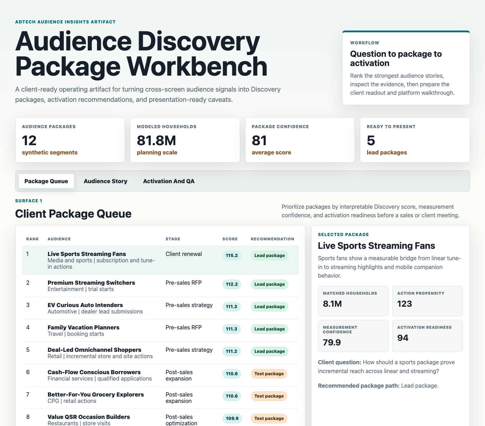
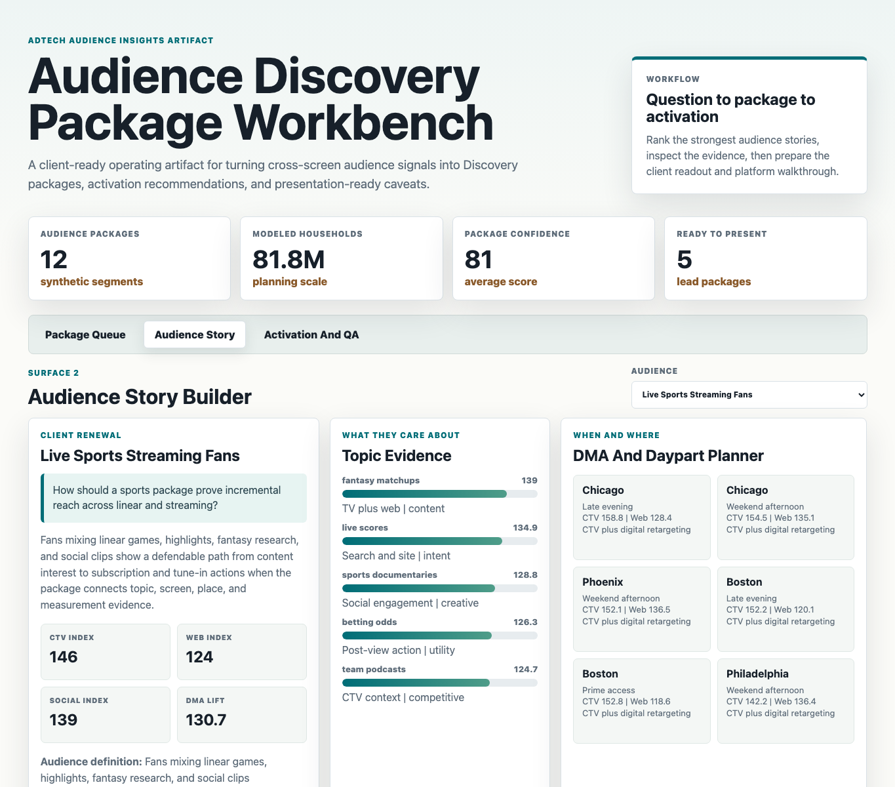
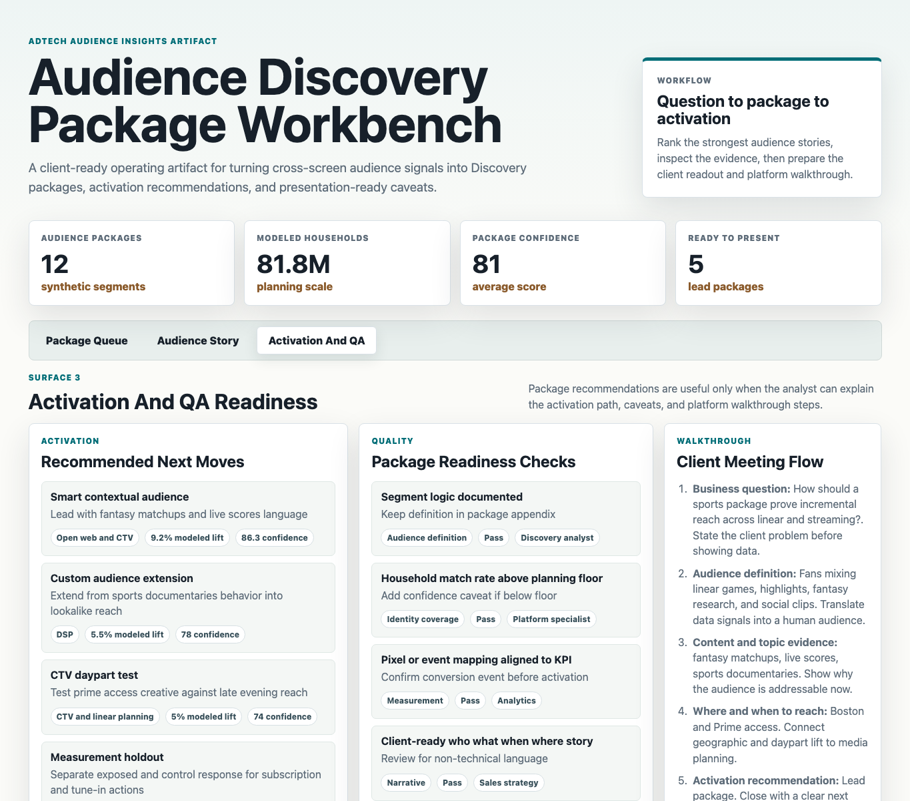

# Audience Discovery Package Workbench

An interactive adtech audience insights portfolio artifact for a unified DSP, SSP, and data-platform sales strategy team. The workbench turns synthetic cross-screen audience signals into client-ready Discovery packages, activation recommendations, QA caveats, and platform walkthrough prompts.

## What This Project Shows

Audience insights roles do not only rank segments. They turn complex data into a clear package that a seller, client services partner, agency planner, and client can all use. This artifact models that workflow from business question to audience story to activation plan.

The workbench demonstrates how an analyst can:

- Frame a client or RFP question around a primary KPI.
- Score audience packages using topic affinity, action propensity, cross-screen behavior, match scale, measurement confidence, and activation readiness.
- Translate the output into who, what, when, where, activation, and measurement language.
- Separate strong package candidates from packages that need a caveat or readiness check before client presentation.

## Screenshots



**Client package queue:** Ranks synthetic audience packages by Discovery score, sales stage, KPI, measurement confidence, and recommended package path.



**Audience story builder:** Converts the selected audience into client-ready narrative, topic evidence, DMA lift, daypart fit, and channel guidance.



**Activation and QA readiness:** Shows recommended activation tactics, package-readiness checks, owners, and walkthrough steps for a client or agency meeting.

## Data Strategy

The artifact uses deterministic synthetic data because real audience Discovery, ACR, identity, campaign, and client performance data is proprietary. Public product and domain research informed the structure of the workflow, but no private platform data is used and the data does not represent any real advertiser, agency, publisher, household, device, campaign, or customer.

The generator is [`scripts/score_operating_data.py`](scripts/score_operating_data.py). It uses seed `230523` and creates:

- `data/audience_segments.csv`: 12 synthetic audience packages across entertainment, restaurants, automotive, travel, financial services, wellness, retail, home improvement, B2B software, sports, CPG, and luxury retail.
- `data/topic_affinity.csv`: 60 modeled topic, keyword, and content-affinity signals.
- `data/dma_daypart_signals.csv`: 144 DMA and daypart planning rows with lift indices, budget weights, and recommended channel paths.
- `data/activation_plan.csv`: 48 activation recommendations across contextual audiences, DSP paths, CTV tests, and measurement holdouts.
- `data/qa_checks.csv`: 60 checks for audience definition, identity coverage, measurement, narrative, and activation.
- `data/package_sections.csv`: 60 client package sections that translate analysis into presentation structure.

Model assumptions are documented in [`data/README.md`](data/README.md) and field definitions are documented in [`data_dictionary.md`](data_dictionary.md).

## Scoring Logic

Discovery score is a transparent weighted score:

- Topic affinity: 19%
- Action propensity: 15%
- CTV index: 13%
- Web index: 10%
- Social index: 7%
- Match scale: 12%
- Measurement confidence: 12%
- Activation readiness: 12%

The goal is explainability. A rules-based score is easier to defend in a client-facing Discovery package than a black-box model, and the role this artifact is built for values clear recommendations, presentation confidence, and stakeholder trust.

## Analysis Outputs

- [`analysis/executive_findings.md`](analysis/executive_findings.md)
- [`analysis/analysis_plan.md`](analysis/analysis_plan.md)
- [`analysis/sql_checks.sql`](analysis/sql_checks.sql)
- [`analysis/outputs/priority_queue.csv`](analysis/outputs/priority_queue.csv)

## Run Locally

```bash
npm start
```

If port `4173` is already in use:

```bash
python3 -m http.server 4273
```

Then open `http://127.0.0.1:4173` or the alternate port.

Regenerate the data and analysis outputs:

```bash
npm run analyze
```

## Scope

This is a static public portfolio artifact with reproducible synthetic data and transparent scoring logic. It does not connect to live DSP, SSP, DMP, identity graph, clean room, ACR, TV viewership, social, web analytics, CRM, ad server, or measurement systems. It does show how an analyst can structure a Discovery package workflow, defend data caveats, and translate audience insights into activation-ready client recommendations.
